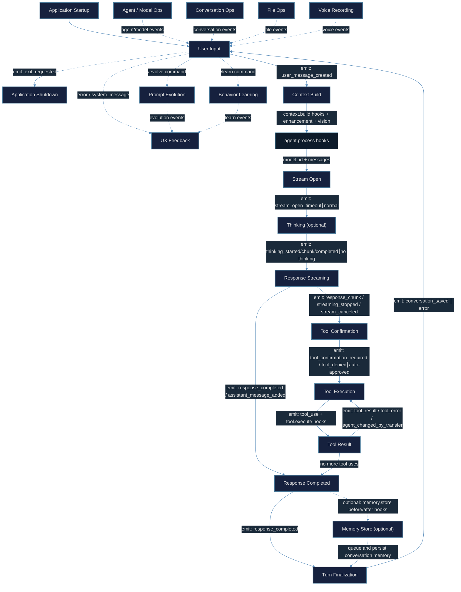

# AgentCrew Workflow Guide

_When to use each feature, how to structure your work, and why things work the
way they do._

The [Getting Started guide](GUIDE_GETTING_STARTED.md) showed you _what_
AgentCrew can do. This guide explains _when_ and _why_ to use each capability —
including every chat command — so you can move from following steps to making
deliberate design decisions about your workflows.

---

## Decision framework

Every time you sit down with AgentCrew, ask yourself three questions:

1. **How many perspectives does this task need?**
   - One → single agent is enough
   - Multiple → create specialized agents and use `@AgentName` hand-offs

2. **Does this task need external information?**
   - No → agent can work from its system prompt alone
   - Yes → enable `web_search`, `browser`, or MCP tools

3. **Should this be interactive or automated?**
   - Exploratory or iterative → chat mode (GUI or console)
   - Repetitive or scripted → job mode or A2A server

---

## Console command reference

Every command available inside the chat interface, with when and why to use it.

> Commands are listed as they appear in the console. Arguments in `[brackets]`
> are optional; `<angle brackets>` are required.

### Agent management

| Command              | When to use                                                           | Why                                                                                                                                                                       |
| -------------------- | --------------------------------------------------------------------- | ------------------------------------------------------------------------------------------------------------------------------------------------------------------------- |
| `/agent [name]`      | You need a different specialty — switch from Coding to Architect      | With no arguments, lists all agents. With a name, switches the active agent, loading its tools and system prompt.                                                         |
| `@<name> <task>`     | A subtask belongs to another agent's specialty                        | Hands off the task with full conversation context. The receiving agent uses its own tools and prompt.                                                                     |
| `/agent_mode [mode]` | You want to control how agents interact — transfer, delegate, or none | With no arguments, shows current mode. `transfer` enforces hand-offs via transfer tool. `delegate` allows parallel tool delegation. `none` disables cross-agent features. |
| `/toggle_transfer`   | Quick toggle between transfer enforcement on and off                  | Backward-compatible shortcut that toggles between `transfer` and `none` modes.                                                                                            |

### Conversation control

| Command                | When to use                                                                | Why                                                                                                                                  |
| ---------------------- | -------------------------------------------------------------------------- | ------------------------------------------------------------------------------------------------------------------------------------ |
| `/clear`               | Starting a new, unrelated task                                             | Resets conversation history, prevents context pollution from the previous topic.                                                     |
| `/list`                | You want to review, load, or delete saved conversations                    | Shows all saved conversations with timestamps, previews, and fork information.                                                       |
| `/load <id\|number>`   | Resuming a previous conversation                                           | Restores full conversation history from a saved session. Use the ID or number from `/list`.                                          |
| `/fork [turn]`         | A conversation went off-track and you want to branch from an earlier point | With no argument, shows available turns. With a turn number, creates a new conversation from that point, discarding later messages.  |
| `/jump [turn]`         | You want to rewind the conversation to a previous turn                     | With no argument, shows available turns. With a turn number, truncates messages after that turn while keeping the same conversation. |
| `/consolidate [count]` | The conversation is getting long and you want to save tokens               | Summarizes older messages into a single condensed message, preserving the most recent `count` messages (default: 10).                |
| `/unconsolidate`       | You want to restore messages after a consolidation                         | Reverses the last consolidation, restoring the original messages.                                                                    |

### Model and provider

| Command                  | When to use                                                         | Why                                                                                                                                                                                                                                                                          |
| ------------------------ | ------------------------------------------------------------------- | ---------------------------------------------------------------------------------------------------------------------------------------------------------------------------------------------------------------------------------------------------------------------------- |
| `/model [model_id]`      | The current model is too slow, too expensive, or not capable enough | With no arguments, lists all available models grouped by provider. With an ID, switches the AI model mid-session without restarting.                                                                                                                                         |
| `/think <budget\|level>` | The task requires multi-step reasoning, math, or deep analysis      | Enables extended reasoning mode. The value depends on your provider: **Anthropic** uses token budgets (`1024`, `4096`, `0` to disable); **OpenAI / Gemini** use levels like `low`, `medium`, `high`, `none` to disable. Shows current setting when called without arguments. |
| `/usage`                 | You want to check API usage limits or remaining quota               | Shows current provider usage limits, daily counts, and account credit balance (CrofAI providers).                                                                                                                                                                            |

### File operations

| Command        | When to use                                      | Why                                                                                             |
| -------------- | ------------------------------------------------ | ----------------------------------------------------------------------------------------------- |
| `/file <path>` | You want the agent to read or reference a file   | Attaches the file content to the next agent turn. Supports multiple files (space-separated).    |
| `/drop [path]` | You attached the wrong file or no longer need it | With no argument, lists queued files. With a path, removes that file from the processing queue. |

### Debugging

| Command                        | When to use                                                               | Why                                                                                                                                                                                             |
| ------------------------------ | ------------------------------------------------------------------------- | ----------------------------------------------------------------------------------------------------------------------------------------------------------------------------------------------- |
| `/debug [agent\|chat\|system]` | You want to see what the agent sees — messages, history, or system prompt | With no argument, shows both agent and chat messages. `agent` shows only internal agent messages. `chat` shows the streamline (display) messages. `system` shows the current LLM system prompt. |
| `/visual`                      | You want to inspect raw message content                                   | Opens a vim-like viewer to browse the raw conversation with copy support.                                                                                                                       |

### Agent configuration

| Command                        | When to use                                                     | Why                                                                        |
| ------------------------------ | --------------------------------------------------------------- | -------------------------------------------------------------------------- |
| `/edit_agent`                  | You want to modify agent definitions directly                   | Opens `agents.toml` in your default editor for quick manual edits.         |
| `/edit_mcp`                    | You need to add or modify MCP server connections                | Opens `mcp_servers.json` in your default editor.                           |
| `/edit_config`                 | You need to change global settings or API keys                  | Opens `config.json` in your default editor.                                |
| `/export_agent <names> <file>` | Sharing agent configurations with a teammate or backing them up | Exports selected agent definitions (comma-separated names) to a TOML file. |
| `/import_agent <file\|url>`    | Loading agent configurations from a teammate or backup          | Imports agent definitions from a TOML file or URL.                         |

### MCP (Model Context Protocol)

| Command                | When to use                                                      | Why                                                                                                              |
| ---------------------- | ---------------------------------------------------------------- | ---------------------------------------------------------------------------------------------------------------- |
| `/mcp [server/prompt]` | You want to check connected MCP tools or fetch a prompt template | With no argument, lists all MCP prompts. With `server_id/prompt_name`, fetches and renders that prompt template. |

### Agent behavior and learning

| Command                                    | When to use                                                              | Why                                                                                                         |
| ------------------------------------------ | ------------------------------------------------------------------------ | ----------------------------------------------------------------------------------------------------------- |
| `/list_behaviors`                          | Review patterns the agent has learned from your interactions             | Shows all stored adaptive behaviors (global and project scope) with their conditions and actions.           |
| `/update_behavior <scope> <id> <behavior>` | You want to manually add or update a learned behavior                    | Creates or updates a behavior with format: `when [condition], do [action]`. Scope is `global` or `project`. |
| `/delete_behavior <scope> <id>`            | A learned behavior is no longer useful                                   | Removes a specific behavior by ID and scope.                                                                |
| `/clean_behaviors [scope]`                 | Behaviors have accumulated duplicates or conflicts                       | Normalizes and deduplicates adaptive behaviors. Scope defaults to `global`.                                 |
| `/learn`                                   | The current conversation has patterns worth saving                       | Extracts and stores reusable behaviors from the conversation for future sessions.                           |
| `/evolve`                                  | You want the agent to improve its system prompt based on past experience | Analyzes agent memory and proposes a system prompt evolution for review and approval.                       |

### Voice

| Command      | When to use                       | Why                                                                                        |
| ------------ | --------------------------------- | ------------------------------------------------------------------------------------------ |
| `/voice`     | You want to speak instead of type | Starts voice recording (requires `--with-voice` flag). Press Enter to stop and transcribe. |
| `/end_voice` | You want to stop recording early  | Stops the current voice recording and transcribes what was captured.                       |

### Session control

| Command                | When to use                                                   | Why                                                                                          |
| ---------------------- | ------------------------------------------------------------- | -------------------------------------------------------------------------------------------- |
| `/toggle_session_yolo` | You trust the current session and want to skip tool approvals | Toggles YOLO mode for the current session only — tools execute without confirmation prompts. |
| `/retry`               | The last response was incomplete or incorrect                 | Re-sends the last user message to get a fresh response from the agent.                       |
| `/help`                | You need a reminder of available commands                     | Re-prints the welcome message with the complete command list.                                |
| `/exit` or `/quit`     | You are done working                                          | Closes AgentCrew cleanly.                                                                    |
| `Ctrl+C`               | The agent is taking too long or producing unwanted output     | Interrupts the current agent response mid-stream.                                            |

---

## Workflow patterns

### Pattern 1: Single-agent deep dive

**When to use:** You have a well-defined task that fits one specialty — write a
function, research a question, review a file.

**Why this works:** One agent stays focused. No hand-off overhead, no context
switching.

```
> Analyze this codebase for security vulnerabilities.
```

**Best for:** Code review, quick research, file editing, debugging.

### Pattern 2: Sequential hand-off (pipeline)

**When to use:** A task has distinct phases where each phase depends on the
previous one and needs a different specialty.

**Why this works:** Each agent sees the full conversation history. The
Architect's design is available when the Coder starts implementing, and the
Reviewer sees everything when checking the result.

```
> @Architect  Design a REST API for a todo app.
> @Coding     Implement the API in FastAPI.
> @Reviewer   Review the implementation.
```

**Best for:** Feature development, report generation, document creation.

**When NOT to use:** If the phases are independent (no dependency chain), run
them in parallel with separate conversations instead.

### Pattern 3: Research → Synthesize

**When to use:** You need information gathered from multiple sources, then
compiled into a structured deliverable.

**Why this works:** Separating research from synthesis keeps the Researcher
focused on gathering (not formatting) and the Synthesizer focused on structure
(not fact-finding).

```
> @Researcher  Find best practices for rate-limiting in FastAPI.
>              Gather at least 3 approaches with pros and cons.
>
> @Synthesizer Compile the findings into a recommendation document.
```

**Best for:** Technical research, competitive analysis, decision memos.

### Pattern 4: Parallel delegation

**When to use:** You have multiple independent subtasks that can proceed
simultaneously.

**Why this works:** Each agent works independently. Run parallel tasks in
separate terminal sessions or job commands.

```bash
# Terminal 1
agentcrew job --agent "Researcher" "Research auth methods" ./auth.md

# Terminal 2
agentcrew job --agent "Researcher" "Research deployment options" ./deploy.md
```

**Best for:** Independent research tracks, multiple code reviews, parallel
documentation.

### Pattern 5: Feedback loop

**When to use:** An agent produces output that needs revision based on review.

**Why this works:** Keep the same agent working on its own output — it has full
context of what it produced and why.

```
> @Coding  Implement a data validation module.
>
> (Reads the code, finds an issue)
> /agent Coding
> Add input sanitization to the validate_email function.
```

**Best for:** Iterative development, document revision, code refinement.

### Pattern 6: Multi-instance network (remote agents)

**When to use:** Your agents need access to resources on different machines — a
build server, a database server, a restricted network.

**Why this works:** A2A protocol lets agents on one AgentCrew instance delegate
tasks to agents on another instance, as if they were local.

```toml
# In ~/.AgentCrew/agents.toml — local machine
[[remote_agents]]
name = "BuildServer"
description = "Runs on the build machine with access to build tools"
url = "http://build-server:41241"
```

```
> @BuildServer  Build the project and run tests.
```

**Best for:** Distributed teams, build automation, cross-network operations.

---

## Tool selection guide

Each tool exists for a reason. Here is when to enable — and disable — each one.

### code_analysis

**Enable when:** The agent works with source code — reading, understanding, or
debugging.

**Disable when:** The agent never touches code (pure writing, research, voice).

**Why:** Code analysis tools (read_file, grep, analyze_repo, find_files) add
context to every prompt. An agent that never uses them wastes tokens carrying
the tool definitions.

### file_editing

**Enable when:** The agent needs to create or modify files on disk.

**Disable when:** Research-only or read-only agents.

**Why:** File editing uses search/replace blocks with automatic backups and
syntax validation. It is powerful but requires user approval by default. Disable
it on agents that should never modify files.

### web_search

**Enable when:** The agent needs current information from the internet.

**Disable when:** The agent works entirely from internal knowledge (e.g., a
strictly internal codebase agent).

**Why:** `web_search` uses Tavily to search and extract from the web. Without a
TAVILY_API_KEY, this tool is unavailable.

### fetch_webpage

**Enable when:** The agent needs the full content of a specific URL.

**Disable when:** Combined with `browser` — browser automation can do everything
`fetch_webpage` does and more.

**Why:** `fetch_webpage` is lightweight and fast. `browser` is heavier but can
handle JavaScript-rendered pages and interactive workflows.

### browser

**Enable when:** The agent needs to interact with web pages — click buttons,
fill forms, capture screenshots, extract JS-rendered content.

**Disable when:** You only need static page content (use `fetch_webpage`
instead).

**Why:** Browser automation starts a headless Chrome instance. It is powerful
but resource-intensive. Use it deliberately.

### command_execution

**Enable when:** The agent runs build commands, tests, scripts, or
administrative tasks.

**Disable when:** The agent should never execute shell commands (e.g., a
documentation-only agent).

**Why:** Command execution has rate limits, blocked patterns, and audit logging.
It requires user approval by default, and is blocked in Docker containers.

### memory

**Enable for:** Almost every agent.

**Disable when:** A stateless agent that should not retain conversation context
(e.g., a one-shot job agent).

**Why:** Memory stores and retrieves conversation context across sessions. It is
the primary way agents learn from past interactions.

### adaptive_learning

**Enable when:** You want the agent to learn behavioral patterns over time and
adjust its responses without manual prompt editing.

**Disable when:** You prefer full control over the agent's behavior through
system prompts.

**Why:** Adaptive learning stores "when {condition}, do {action}" patterns
extracted from your corrections and feedback. It evolves the agent organically.

### transfer

**Always available** in multi-agent setups. You cannot disable it.

**Why:** `transfer` powers the `@AgentName` hand-off syntax. Without it, agents
cannot delegate tasks.

### voice

**Enable when:** You use AgentCrew hands-free or in a voice-interactive mode.

**Disable when:** You only use text input.

**Why:** Voice requires additional dependencies (ElevenLabs or DeepInfra) and
the `--with-voice` flag on launch.

### MCP tools

**Enable when:** You have connected external services via the Model Context
Protocol — databases, APIs, specialized tools.

**Disable when:** No MCP servers are configured.

**Why:** MCP extends AgentCrew with external tool ecosystems. Each MCP server
registers its own tools with the agents it is enabled for.

---

## Agent design patterns

### How to decide agent boundaries

The golden rule: **One agent, one job.** If you find yourself writing "do X, but
also Y" in an agent's description, split it.

| Too broad                         | Better split                 |
| --------------------------------- | ---------------------------- |
| "Handles everything"              | Architect + Coder + Reviewer |
| "Researches and writes docs"      | Researcher + TechnicalWriter |
| "Manages infrastructure and code" | DevOps + Coder               |

### System prompt structure

An effective system prompt has three parts:

```toml
system_prompt = """
# 1. Role and goal — what this agent is and what it prioritizes
You are a security reviewer. Your goal is to identify vulnerabilities.

# 2. Process — how the agent should approach tasks (the "how")
Always check for: injection flaws, auth bypasses, data exposure.
Use code_analysis to read files before making claims.

# 3. Constraints — what the agent should NOT do
Do not suggest architectural changes. Do not write code.
Today is {current_date}.
"""
```

### Temperature by agent type

| Agent type    | Temperature | Why                                  |
| ------------- | ----------- | ------------------------------------ |
| Code reviewer | 0.0–0.3     | Deterministic, consistent analysis   |
| Implementer   | 0.3–0.5     | Focused but flexible problem-solving |
| Architect     | 0.5–0.7     | Creative exploration of trade-offs   |
| Writer        | 0.7–0.9     | Varied expression, natural language  |
| Researcher    | 0.4–0.6     | Balanced between focus and discovery |

---

## Conversation structure best practices

### DO: Provide context upfront

```
> I am building a SaaS product for small businesses.
> The tech stack is Python + FastAPI + PostgreSQL.
> @Architect Design the data model for multi-tenancy.
```

The agent needs this context to give relevant answers. Dumping it all in one
message is better than revealing it piece by piece.

### DO: Use specific, actionable requests

```
> @Coding Implement the create_user endpoint with:
> - Email validation
> - Password hashing (bcrypt)
> - Rate limiting (100 req/hour)
```

Vague requests produce vague results. Specific requests produce usable output.

### DON'T: Assume agents share memory

Each agent has its own memory scope. If the Architect learned a preference ("use
PostgreSQL"), the Coder does not automatically know this. State important
context in every hand-off.

### DO: Use `/clear` between unrelated tasks

Starting fresh prevents context pollution. Old instructions and examples from a
previous task can leak into responses for a new task.

### DON'T: Let context grow indefinitely

Long conversations consume tokens and dilute focus. Use `/clear` or
`/fork <turn_number>` when the conversation drifts.

### Context shrinking: automatic token management

AgentCrew has a built-in mechanism to prevent long conversations from hitting
the model's context limit. It is called **context shrinking**.

**How it works:** When the total input tokens exceed 85% of the model's maximum
context window, AgentCrew automatically replaces verbose tool results from
earlier turns with a compact placeholder:

```
[tool:web_search(query=latest python async best practices...) was truncated]
```

The last 10 messages are always kept intact so the current conversation flow
remains readable. You can control this behavior through `config.json`:

```json
{
  "global_settings": {
    "auto_context_shrink": true,
    "shrink_excluded": ["web_search", "read_file"]
  }
}
```

**When to disable it:** If you are working on a short conversation or need every
tool result preserved in full, set `"auto_context_shrink": false`.

**When to exclude a tool from shrinking:** Some tools return critical data that
the agent needs verbatim — `web_search` results, `read_file` contents,
`code_analysis` output. Add their names to `shrink_excluded` to preserve their
results intact.

**Advanced — max token cap:** Set the `AGENTCREW_DEFAULT_MAX_CONTEXT`
environment variable to override the 85% threshold with a fixed token count:

```bash
export AGENTCREW_DEFAULT_MAX_CONTEXT="120000"
```

### DO: Use `/think` for complex reasoning

```
> /think high
> Analyze this cryptographic implementation for vulnerabilities.
```

Extended reasoning helps with math, logic, security analysis, and multi-step
planning. Use `low` or `medium` for everyday tasks and `high`/`xhigh` for deep
analysis.

---

## When to use each interaction mode

| Scenario                                     | Mode         | Why                                                 |
| -------------------------------------------- | ------------ | --------------------------------------------------- |
| Daily development, exploring ideas           | GUI          | Visual, drag-and-drop files, diffs, conversation UI |
| Working over SSH, tmux, or minimal resources | Console      | Keyboard-driven, low overhead                       |
| CI/CD pipeline, scheduled task               | Job          | Non-interactive, single-shot, output to file        |
| Integrating with other apps or services      | A2A server   | HTTP API, remote agent access                       |
| Building a custom IDE extension or client    | ACP protocol | WebSocket, real-time, full session control          |

---

## Common pitfalls and how to avoid them

| Pitfall                                        | Solution                                              |
| ---------------------------------------------- | ----------------------------------------------------- |
| Agent has too many tools, loses focus          | Strip tools to the minimum the agent actually uses    |
| Hand-off loses context                         | Include key decisions and constraints in the hand-off |
| Agent gives outdated information               | Enable `web_search` and prompt the agent to verify    |
| Conversation becomes incoherent after 50 turns | Use `/clear` or `/fork` to reset                      |
| Job mode output is too long                    | Use `--output-schema` to enforce structured responses |
| Agent refuses to use a tool                    | Verify the tool is in the agent's `tools` list        |
| MCP server tools not appearing                 | Check `enabledForAgents` in mcp_servers.json          |

---

# AgentCrew Lifecycle Flow

## Lifecycle — Event Emission Flow

The diagram below shows the sequential flow of event emissions through the
application lifecycle. Each box is a lifecycle phase that emits one or more
events as it executes.



---

## Event Reference

### Stream Events — `MessageHandler._run_stream_response()`

| Event                     | When                                    | Payload                            |
| ------------------------- | --------------------------------------- | ---------------------------------- |
| `stream_open_timeout`     | First chunk not received within timeout | `session_id`, `timeout`            |
| `streaming_stopped`       | User requested stop mid-stream          | `response`                         |
| `stream_cancel_requested` | Cancel signal sent                      | `session_id`                       |
| `stream_canceled`         | Stream fully canceled                   | `session_id`, `assistant_response` |
| `thinking_started`        | First thinking chunk received           | `agent_name`                       |
| `thinking_chunk`          | Each subsequent thinking chunk          | `chunk`                            |
| `thinking_completed`      | Thinking phase ended, response begins   | `content`                          |
| `response_chunk`          | Each text chunk from LLM                | `chunk`, `full_response`           |
| `response_completed`      | Full response ready (no tool uses)      | `response`                         |
| `assistant_message_added` | Message appended to history             | `response`                         |

### Tool Events — `ToolManager.execute_tool()`, `ToolManager._execute_parallel_batch()`

| Event                        | When                               | Payload                              |
| ---------------------------- | ---------------------------------- | ------------------------------------ |
| `tool_confirmation_required` | Tool needs user approval           | `tool_use`, `confirmation_id`        |
| `tool_denied`                | User rejected tool                 | `tool_use`, `message`                |
| `tool_use`                   | Tool approved and about to execute | `id`, `name`, `input`                |
| `tool_result`                | Tool executed successfully         | `tool_use`, `tool_result`, `message` |
| `tool_error`                 | Tool execution failed              | `tool_use`, `error`, `message`       |

> **Hook points**: `tool.execute`, `context.build`, `agent.process`, and
> `memory.store` are currently wired. `tool.execute` hooks can modify or cancel
> tool calls. `context.build` hooks can modify the message list and system
> prompt. `agent.process` hooks can modify the model input and result.
> `memory.store` hooks can modify or cancel queued memory input, then modify the
> generated memory immediately before its derived data is persisted.

### Conversation Events — `MessageHandler`, Command Handlers

| Event                       | When                               | Payload                                 |
| --------------------------- | ---------------------------------- | --------------------------------------- |
| `user_message_created`      | User message added to history      | `message`, `display_text`, `with_files` |
| `file_processing`           | File processing started            | `file_path`                             |
| `file_processed`            | File processing completed          | `file_path`, `message`                  |
| `file_dropped`              | File removed from queue            | `file_path`                             |
| `conversation_loaded`       | Conversation restored from storage | `id`, `history`, `token_usage`          |
| `conversation_saved`        | Turn persisted to storage          | `id`                                    |
| `conversations_changed`     | Conversation list updated          | —                                       |
| `clear_requested`           | `/clear` command                   | —                                       |
| `exit_requested`            | `/exit` command                    | —                                       |
| `consolidation_completed`   | Context consolidation done         | `result`                                |
| `unconsolidation_completed` | Context unconsolidation done       | `result`                                |

### Agent / Model Events — Command Handlers

| Event                       | When                         | Payload                  |
| --------------------------- | ---------------------------- | ------------------------ |
| `agent_changed`             | Active agent switched        | `agent_name`             |
| `agent_changed_by_transfer` | Transfer tool switched agent | `tool_use`, `agent_name` |
| `agents_listed`             | Agent list displayed         | `agents`                 |
| `model_changed`             | Active model switched        | `id`, `name`, `provider` |
| `models_listed`             | Model list displayed         | `models_by_provider`     |
| `transfer_enforce_toggled`  | Transfer enforcement toggled | `status`                 |
| `agent_command_result`      | Agent command completed      | `success`, `message`     |

### Evolution Events — `PromptEvolutionCoordinator`

| Event                     | When                                | Payload                                                     |
| ------------------------- | ----------------------------------- | ----------------------------------------------------------- |
| `evolution_started`       | `/evolve` initiated                 | `agent_name`                                                |
| `evolution_summary_ready` | Analysis complete, waiting for user | `agent_name`, `analysis_summary`, `generated_summary`, etc. |
| `evolution_applied`       | User approved revision              | `agent_name`, previous/revised prompts                      |
| `evolution_declined`      | User declined revision              | —                                                           |
| `evolution_finished`      | Evolution flow ended                | —                                                           |

### Other Events

| Domain       | Events                                                                                                                                                              | Emitted From             |
| ------------ | ------------------------------------------------------------------------------------------------------------------------------------------------------------------- | ------------------------ |
| **Learning** | `learn_behavior_confirmation`                                                                                                                                       | `LearnReviewCoordinator` |
| **Voice**    | `voice_recording_started`, `voice_recording_stopping`, `voice_recording_completed`, `voice_activate`                                                                | Voice command handlers   |
| **UX**       | `error`, `system_message`, `debug_requested`, `think_budget_set`, `update_token_usage`, `jump_performed`, `fork_and_switch_performed`, `fork_created`, `mcp_prompt` | Various handlers         |

---

## Hook Points Reference

| Hook Point         | Status     | Signature                  | Purpose                    |
| ------------------ | ---------- | -------------------------- | -------------------------- |
| **tool.execute** ★   | ✅ Active  | before: `(ctx) → ctx⎮None` | Modify/cancel tool calls          |
| **agent.process** ★  | ✅ Active  | before: `(ctx)`             | Modify ``model_id`` and ``messages`` before LLM; modify ``tool_uses`` and ``token_usage`` after |
|                     |            | after:  `(ctx, res) → res`  |                                    |
| **context.build** ★  | ✅ Active  | before: `(ctx) → ctx⎮None` | Modify context before LLM          |
|                     |            | after:  `(ctx, res) → res`  |                                    |
| **user.message** ★  | ✅ Active  | before: `(ctx) → ctx⎮None` | Intercept user input before processing |
| **response.complete** ★ | ✅ Active  | after: `(ctx, res) → res`  | Post-process final response          |
| **memory.store** ★ | ✅ Active  | before: `(ctx) → ctx⎮None` | Modify/cancel memory input          |
|                     |            | after: `(ctx, res) → res`  | Modify generated memory before persistence |
| memory.retrieve     | 🔄 Develop | before/after               | Intercept retrieval                 |
| agent.transfer      | 🔄 Develop | before/after               | Intercept hand-offs                |
| agent.delegate      | 🔄 Develop | before/after               | Intercept delegation               |

---

## Event Consumers

| Consumer                    | Subscriptions        | Type                                               |
| --------------------------- | -------------------- | -------------------------------------------------- |
| **ConsoleUI**               | ~55                  | Rich-text terminal via `_register_subscriptions()` |
| **Qt GUI**                  | ~50                  | PyQt6 desktop UI                                   |
| **ACP ClientCommunication** | Direct calls         | ACP protocol updates                               |
| **Plugins**                 | Via `_OwnedEventBus` | External Python modules                            |

---

## Key Design Points

- **Events ≠ Hooks**: Events are one-way broadcasts for UI/logging. Hooks are
  interception points with before/after semantics and cancellation.
- **`tool.execute`, `agent.process`, `context.build`, `user.message`, `response.complete`, and `memory.store` are wired**:
  The remaining hooks are in development awaiting runtime integration.
- **Plugins get owned facades**: `_OwnedEventBus` and `_OwnedHookRegistry`
  auto-assign ownership for deterministic cleanup.
- **Events defined in `events/constants.py`**: Each needs a constant + TypedDict
  payload + `EVENT_PAYLOAD_MAP` entry.

---

## Reference

- [GUIDE_GETTING_STARTED.md](GUIDE_GETTING_STARTED.md) — Installation and first
  steps
- [CONFIGURATION.md](CONFIGURATION.md) — Provider, agent, and MCP configuration
- [PLUGIN_DEVELOPMENT.md](PLUGIN_DEVELOPMENT.md) — Building plugins
- [CONTRIBUTING.md](CONTRIBUTING.md) — Contributing to the project
