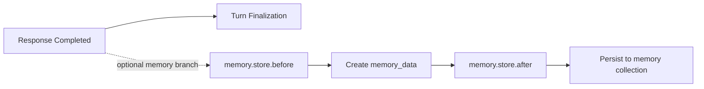

# AgentCrew Plugin Development

AgentCrew plugins can subscribe to application events and register lifecycle
hooks. `tool.execute`, `agent.process`, `context.build`, and `memory.store` are
currently wired into runtime execution. Contracts for the other declared hook
points are available for forward-compatible plugin development. Plugins are discovered by scanning
two filesystem directories:

1. `.agentcrew/plugins/` — **project-based plugins** (higher precedence)
2. `~/.AgentCrew/plugins/` — **global plugins** (fallback)

Each entry in these directories may be a `.py` file (single-file plugin) or a
subdirectory containing `main.py` (project plugin).

> **Security**: Project plugins are **not activated automatically** unless
> `trusted_project_plugins=True` is passed to `PluginManager`. This prevents
> automatic code execution when AgentCrew is run from an untrusted project
> directory. Symlinked plugin entries are rejected. All resolved source paths
> are logged before import.

> **When to build a plugin:**
> - You need custom behavior on every tool execution (logging, auditing, transforming)
> - You want to react to application events (message sent, tool completed, agent changed)
> - You are building integrations that should work across all agents without configuration
> - You want to package and share reusable extensions with the community
>
> **When not to build a plugin:**
> - A custom tool registered with a specific agent is sufficient
> - The behavior is temporary or experimental
> - You can achieve the same result by configuring an MCP server

## Plugin interface

Implement `AgentCrew.modules.events.Plugin` with a globally unique `name`. `version`, `description`, and `dependencies` are optional metadata.

```python
from AgentCrew.modules.events import AppEvents, Hook, HookPhase, HookPoints, Plugin


class ExamplePlugin(Plugin):
    @property
    def name(self):
        return "example"

    @property
    def version(self):
        return "1.0.0"

    @property
    def dependencies(self):
        return []

    async def activate(self, bus, hooks):
        bus.on(AppEvents.SYSTEM_MESSAGE, self.on_system_message)
        hooks.register(
            Hook(
                point=HookPoints.TOOL_EXECUTE,
                phase=HookPhase.BEFORE,
                handler=self.before_tool,
            )
        )

    async def deactivate(self):
        pass

    def on_system_message(self, message):
        print(message)

    def before_tool(self, context):
        return context
```

`activate()` receives plugin-owned EventBus and HookRegistry facades. AgentCrew automatically removes registrations made through these facades on unload, failed activation, and reload. `deactivate()` must still release resources outside EventBus and HookRegistry, such as files, subprocesses, sockets, and background tasks.

### Plugin identity enforcement

The **discovered key** (the filename without ``.py``, or the directory name)
is the authoritative plugin identity. The declared ``name`` property of your
``Plugin`` subclass **must match** this key exactly. If they differ, loading
fails with an error. This ensures dependency references are unambiguous.

```
# Valid:
my_plugin.py           → class name = "my_plugin"
my_project/main.py     → class name = "my_project"

# Invalid (will fail to load):
my_plugin.py           → class name = "my_plugin" ✗
```

### Dependencies

Dependencies are referenced by the discovered key (the filesystem name),
not the class name or any other identifier.

## Discovery

Plugin directories are auto-created on first discovery. No configuration file is needed.

### Single-file plugin

Place a `.py` file directly in the plugins directory. The plugin name is derived
from the filename (without the `.py` extension).

```
.agentcrew/plugins/
  my_plugin.py          ← key: my_plugin
```

The module is loaded from its exact filesystem path under a private AgentCrew
namespace. It will **never** collide with an installed package of the same name.

### Project plugin

Create a subdirectory containing `main.py`. The plugin name is the directory name.

```
.agentcrew/plugins/
  my_project/
    main.py             ← key: my_project
    helper.py           ← importable as ``from .helper import value``
```

Project plugins **do not require** ``__init__.py``. Relative imports work because
AgentCrew synthesizes a private package for the plugin directory. This is useful
for plugins that need multiple files or have dependencies.

### Supported naming rules

Plugin names must match the following pattern:

```
^[A-Za-z0-9][A-Za-z0-9_-]*$
```

- Must start with a letter or digit.
- May contain letters, digits, underscores, and hyphens.
- Dotted names (``foo.bar.py``), hidden names (``.secret.py``), and names with
  spaces are rejected with a warning.

### Duplicate handling

If both ``foo.py`` and ``foo/main.py`` exist **in the same root**, the duplicate
is rejected and a warning is logged. Precedence only applies across scopes
(global vs project), not within one scope.

### Project vs global precedence

When the same plugin name exists in both locations, the project-based version
(in ``.agentcrew/plugins/``) takes precedence over the global version
(in ``~/.AgentCrew/plugins/``).

### Trust boundary

Project plugins execute arbitrary Python code. To prevent automatic code
execution from untrusted directories, project plugins are **not activated**
by default when stored in ``.agentcrew/plugins/``.

You can enable project plugins by adding the following to
``~/.AgentCrew/config.json`` (or ``./config.json``):

```json
{
  "global_settings": {
    "trusted_project_plugins": true
  }
}
```

When a project plugin is skipped, AgentCrew logs a message explaining
how to enable them. Global plugins (in ``~/.AgentCrew/plugins/``) are
always trusted and do not require this setting.

For programmatic usage, you can also pass ``trusted_project_plugins=True``
directly to the ``PluginManager`` constructor.

## Dependencies and lifecycle

- Dependencies activate before dependents.
- Missing, cyclic, or failed dependencies prevent dependent activation.
- A failed plugin does not prevent unrelated plugins from loading.
- Unloading a dependency unloads active dependents first.
- `unload_all()` deactivates plugins in reverse activation order and continues after failures.
- ``reload()`` unloads the plugin, removes its cached module from ``sys.modules``, invalidates
  import caches, then re-imports from the stored source path. Source changes are reflected
  without requiring a process restart.
- Plugins activate and deactivate within the interactive console and GUI lifecycles, where application events and `tool.execute` hooks are integrated.
- A2A server, ACP, and job modes do not load plugins automatically.
- Activation and deactivation are async. Plugins should not assume the short-lived console activation event loop remains available for persistent background tasks.
- AgentCrew **does not install plugin dependencies**. Plugins execute inside the AgentCrew
  Python environment. Third-party dependencies must already be installed. ``pyproject.toml``
  or ``requirements.txt`` inside a plugin directory is not processed automatically.

## EventBus

Use `AppEvents` constants rather than raw event strings. Every event's keyword payload contract is listed in `EVENT_PAYLOAD_MAP`; payloadless events map to `None`.

```python
bus.on(AppEvents.TOOL_RESULT, self.on_tool_result)
bus.emit_sync(AppEvents.SYSTEM_MESSAGE, message="Plugin activated")
```

Plugin-owned EventBus subscriptions are removed automatically. Explicit `off()` is still available for early removal.

## Hook payload contracts

Only `before` and `after` phases are supported. Around hooks are not supported.
Every declared `HookPoints` value has a context and result `TypedDict` exported
from `AgentCrew.modules.events`. `HOOK_PAYLOAD_MAP` exposes those contracts for
runtime introspection:

```python
from AgentCrew.modules.events import HOOK_PAYLOAD_MAP, HookPhase, HookPoints

before_type = HOOK_PAYLOAD_MAP[HookPoints.TOOL_EXECUTE][HookPhase.BEFORE]
after_type = HOOK_PAYLOAD_MAP[HookPoints.TOOL_EXECUTE][HookPhase.AFTER]
```

The map describes the context passed to a before hook and the result envelope
passed to an after hook. After handlers continue to receive both
`(context, result)`.

The declared contracts cover `tool.execute`, `agent.process`, `user.message`,
`response.complete`, `memory.store`, `memory.retrieve`, `context.build`,
`agent.transfer`, and `agent.delegate`. The `tool.execute`, `agent.process`,
`context.build`, and `memory.store` points are actively invoked by AgentCrew
runtime code. The remainder are declared for forward-compatible plugin
development.

Payloads are plain dictionary boundaries. They may contain provider-specific
values typed as `Any`, but must not include credentials, authorization headers,
or live service objects.

## `tool.execute` hooks

### Before hook

A before hook receives an independent context dictionary containing:

- `agent_name`
- `tool_id`
- `tool_use`: the original tool call
- `requested_tool_name` and `requested_tool_input`
- `tool_name` and `tool_input`, which the hook may replace

Return the context to continue. Returning `None` or raising `CancelOperation` rejects the tool call. Rejection produces an agent-compatible rejected result and does not invoke after hooks. User approval is evaluated against the original tool request before hook mutation.

### After hook

An after hook receives the context and this result envelope:

```python
{
  "tool_result": object,
  "is_error": bool
}
```

After hooks currently run only after successful executor completion. If the executor raises, the exception escapes before after-hook dispatch. Executor-error after-hook coverage is planned for a later runtime-wiring slice. On successful execution, after hooks may replace the result. Sequential and parallel approved tools use the same hook pipeline. The special `ask` interaction remains outside `tool.execute`.

## `agent.process` hooks

### Before hook

A before hook receives an `AgentProcessContext` dictionary containing:

- `model_id`: the LLM model identifier (e.g. ``"gpt-4o"``)
- `messages`: the final message list, after all context enhancement and vision
  preprocessing
- `provider`: the LLM provider name (e.g. ``"openai"``)

All fields are mutable. Changes to `model_id` are temporarily applied to the LLM
service for the current turn and restored after the after-hook completes. Changes
to `messages` are passed directly to the LLM's ``stream_assistant_response()``.

Return the (possibly modified) context to continue. Returning `None` or raising
`CancelOperation` aborts the turn without calling the LLM.

### After hook

An after hook receives the (read-only) context and an `AgentProcessResult` result
envelope supplied via the `result=` parameter:

```python
{
  "tool_uses": list[dict],
  "token_usage": TokenUsage,
}
```

Return the (possibly modified) envelope. Changes to `tool_uses` propagate to the
callback (and onward to consumers like ``agent_runner.py`` and
``turn_executor.py``) and to ``self.tool_uses`` on the agent. Changes to
`token_usage` propagate to ``self.token_usage`` and the callback.

If the hook returns a non-dict value, the original values are used unchanged.

### Placement

- **Before**: after all context enhancement, vision preprocessing, and
  ``context.build`` hooks, immediately before ``stream_assistant_response()``.
- **After**: after the stream completes (all chunks consumed), immediately
  before the callback is invoked. Not triggered if the stream is cancelled
  (``GeneratorExit``).

### Example

```python
from AgentCrew.modules.events import Hook, HookPhase, HookPoints, Plugin


class ProcessLoggerPlugin(Plugin):
    @property
    def name(self):
        return "process_logger"

    async def activate(self, bus, hooks):
        hooks.register(
            Hook(
                point=HookPoints.AGENT_PROCESS,
                phase=HookPhase.BEFORE,
                handler=self.log_before,
            )
        )

    async def deactivate(self):
        pass

    def log_before(self, context):
        print(f"Processing with model: {context['model_id']}")
        print(f"Message count: {len(context['messages'])}")
        return context
```

## `context.build` hooks

### Before hook

A before hook receives a `ContextBuildContext` dictionary containing:

- `system_prompt`: the agent's system prompt (sourced from the LLM service)
- `messages`: the raw conversation history (before adaptive context injection)

Return the (possibly modified) context to continue. Returning `None` or raising
`CancelOperation` aborts the current turn — the generator yields nothing and the
LLM is not called.

Both `system_prompt` and `messages` are mutable. Changes to `system_prompt` are
written back via `self.llm.set_system_prompt()` **and persist on the LLM service
beyond the current turn**. They are not automatically restored when the plugin
is deactivated.

### After hook

An after hook receives an empty context and a `ContextBuildResult` result
envelope supplied via the `result=` parameter:

```python
{
  "messages": list[dict],
  "system_prompt": str,
}
```

Return the (possibly modified) envelope. Changes to `messages` become the final
input sent to the LLM. Changes to `system_prompt` are written back via
`self.llm.set_system_prompt()` and persist beyond the current turn.

If the hook returns a non-dict value (e.g. `None` or a string), the original
messages are used unchanged — the caller guards with `isinstance(modified, dict)`.

### Placement

- **Before**: after raw message copy, before adaptive context injection and vision
  preprocessing.
- **After**: after all context enhancement and vision preprocessing, immediately
  before ``pre_process_message()`` returns.

### Example

```python
from AgentCrew.modules.events import Hook, HookPhase, HookPoints, Plugin


class ContextLoggerPlugin(Plugin):
    @property
    def name(self):
        return "context_logger"

    async def activate(self, bus, hooks):
        hooks.register(
            Hook(
                point=HookPoints.CONTEXT_BUILD,
                phase=HookPhase.BEFORE,
                handler=self.log_context_size,
            )
        )
        hooks.register(
            Hook(
                point=HookPoints.CONTEXT_BUILD,
                phase=HookPhase.AFTER,
                handler=self.log_final_size,
            )
        )

    async def deactivate(self):
        pass

    def log_context_size(self, context):
        print(f"Before enhancement: {len(context['messages'])} messages")
        return context

    def log_final_size(self, context, result):
        print(f"After enhancement: {len(result['messages'])} messages")
        return result
```

## `memory.store` hooks

Memory storage is an optional branch after a response completes. The worker
runs both phases before writing the generated memory to the collection.



### Before hook

The before hook receives a `MemoryStoreContext` envelope:

```python
{
  "operation_data": {
    "operation_id": str,
    "user_message": str,
    "assistant_messages": list[str],
    "agent_name": str,
    "session_id": str,
  }
}
```

A hook may replace or modify `operation_data`. Return the context to continue.
Returning `None` or raising `CancelOperation` cancels memory creation and no
collection write occurs.

### After hook

The after hook receives the final `operation_data` as context and a
`MemoryStoreResult` envelope:

```python
{
  "memory_data": dict,
}
```

It runs immediately after `memory_data` is created and before the worker derives
the header, serialized document, context cache, embedding, and metadata. Changes
to `memory_data` therefore affect the object persisted to the collection.

## Failure isolation and cleanup

PluginManager rolls back owned registrations after constructor or activation failure. Cleanup also occurs in a `finally` block when deactivation raises. Plugin authors should make `deactivate()` idempotent for their external resources.


